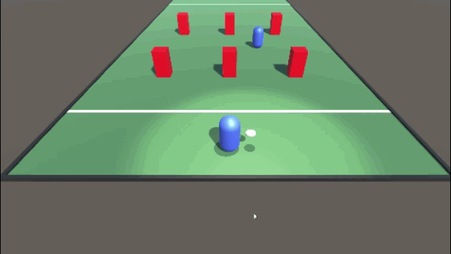

# Flying Frisbee

With this little Ultimate Frisbee game I want to get more familiar with Unity.

## Changelog

### 28.04.2020
More dynamic camera movement:
* Camera is much closer to the player, like 3rd person view
* Camera is always filming in aiming direction (rotating around frisbee)
* Camera follows frisbee very smoothly using linear interpolation

### 25.04.2020
* Camera and spotlight are following the frisbee. 
* Throw angle can be adjusted to throw higher or lower.
* Thrower can switch his throw hand (left/right). 

### 19.04.2020
* Basic aim & throw functionality. 
* Player can move while not holding the frisbee.

